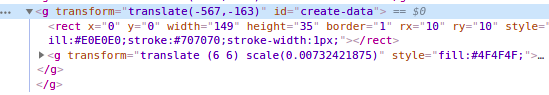
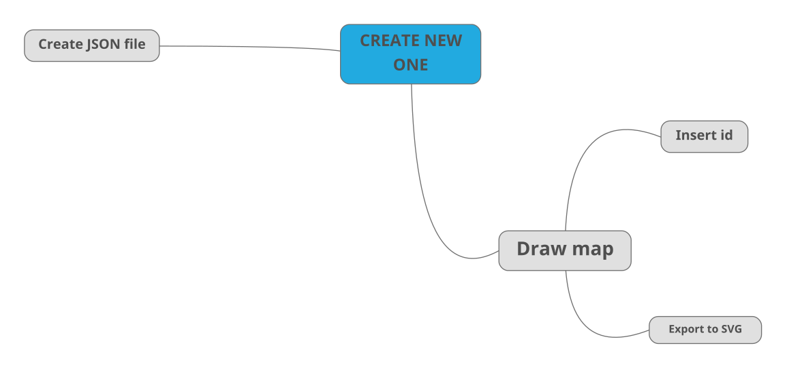
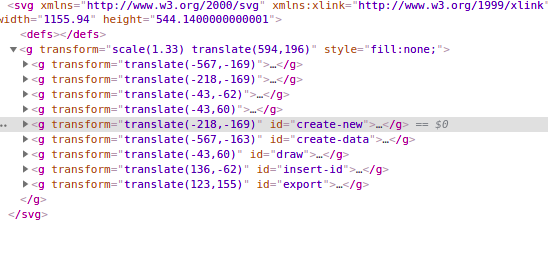

# ROADMAP

A project let user interactive with a roadmap or mindmap

##
Tech: NextJS, NodeJS, MongoDB

Require in every map:
- A map as svg file and every step of map has an id
- A json file with id (nest step will be nest field) of every step of map 
- A node must follow syntax

  

  - g tag outside is a container where contain ID 
    - rect tag is your node border 
    - g tag is your node content

### Example create an map
1. Go to to mindmup.com and create your map (you can create it your self by Illustrator or something else)
  - If you create and export by mindmup, you don't need to do anything else
  - But if not, you need to draw following syntax above
  
  

2. Add your id to map
   
3. Add SVG image to src/images/your-map-name.svg
4. Create JSON file follow your map (Nest step must be a child)
```json
{
  "create-new": {
    "draw": {
      "export": {
        "value": false
      },
      "insert-id": {
        "value": false
      }
    },
    "create-data": {
      "value": false
    },
    "export": {
      "value": false
    }
  }
}
```
5. Add JSON file to src/lib/maps/your-map-name.svg


## Sample Result:

Sample for laravel map
 \
Sample for React map (I copy from roadmap.sh) \


## Author
[Github](https://github.com/anhquandlqb2001) \
Email Me: aqphan200401@gmail.com (welcome, say hi)