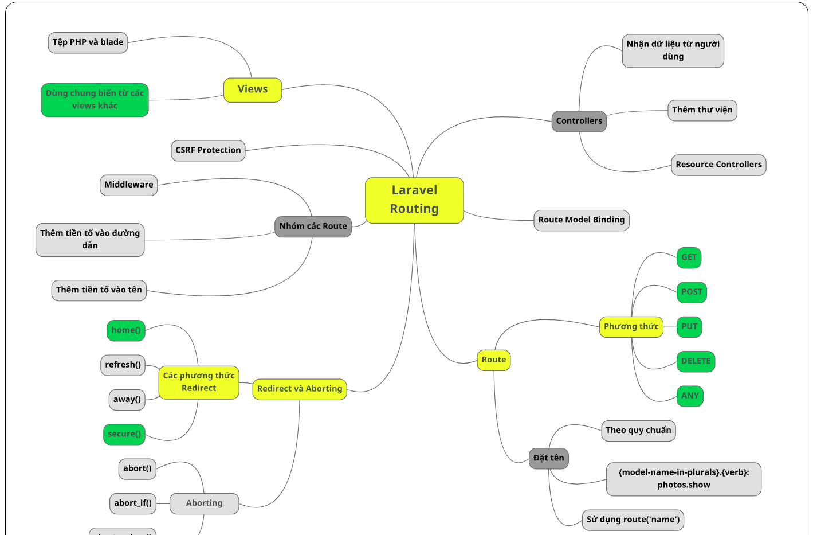
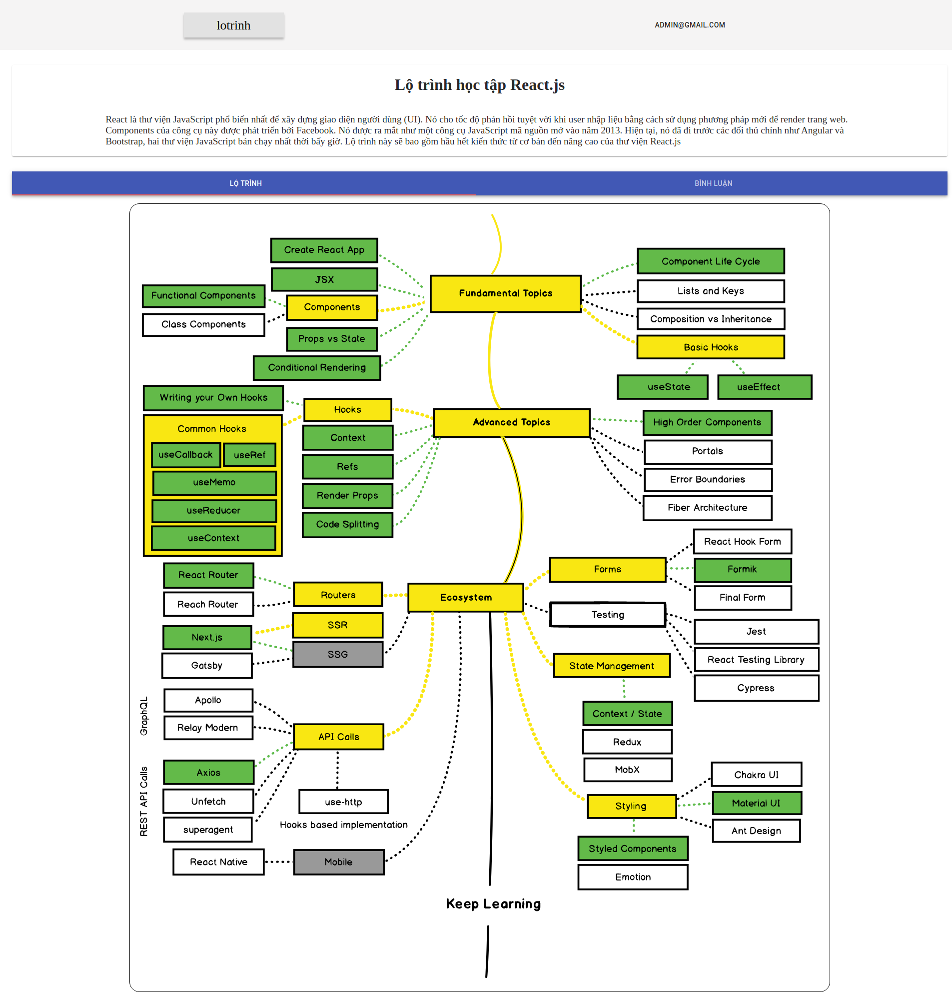

# ROADMAP

A project let user interactive with a roadmap or mindmap

##
Tech: NextJS, NodeJS, MongoDB

Require in every map:
- a map with svg and every step of map has an id
- a json file with id (nest step will be nest field) of every step of map \

ie
JSON file
```json
{
  "create-new": {
    "draw": {
      "export": {
        "value": false,
        "resources:": {}
      },
      "insert-id": {
        "value": false,
        "resources": {}
      }
    },
    "create-data": {
      "value": false,
      "resources": {}
    }
  }
}
```
Map svg


# Sample Result:

Sample for laravel map
 \
Sample for React map (I copy from roadmap.sh) \


## Author
[Github](https://github.com/anhquandlqb2001) \
Email Me: aqphan200401@gmail.com (welcome, say hi)